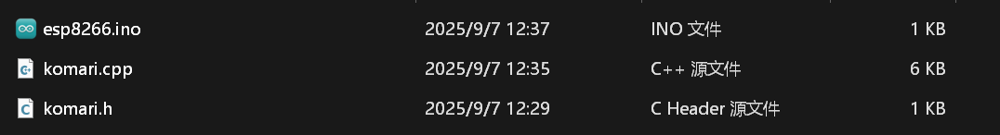
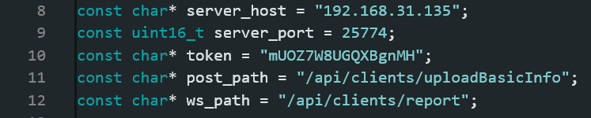

# komari-agent-for-esp8266-arduinoc

本项目是一个适用于 [komari-monitor](https://github.com/komari-monitor) 监控服务的第三方**高性能**监控 Agent

仅适用于 ArduinoC 下的 ESP8266 

易与现有程序相结合，仅需一行代码即可发送 Realtime Info

本项目下载后即可使用 Arduino IDE 打开

## 使用方法

安装 ArduinoJson 与 Websocket 库

将本项目的 `komari.h` 与 `komari.cpp` 拷贝到 Arduino 项目路径下，如:



随后更改 `komari.cpp` 文件头部:



将其改成连接的 Komari 主控的参数

随后，在主文件编写联网与调用代码 (文件位于 esp8266.ino):

```cpp
#include "komari.h"
#include <ESP8266WiFi.h>

const char* ssid = "Demo";
const char* password = "Demo";

void setup() {
  Serial.begin(115200);
  Serial.println("\n--- ESP8266 监控客户端 ---");

  WiFi.begin(ssid, password);
  Serial.print("正在连接.");
  while (WiFi.status() != WL_CONNECTED) {
    delay(500);
    Serial.print(".");
  }
  Serial.println("\nWiFi 已连接");
  Serial.print("IP 地址: ");
  Serial.println(WiFi.localIP());

  if (setupKomari()) {
    Serial.println("[Komari] 初始化成功");
  } else {
    Serial.println("[Komari] 初始化失败");
  }
}

void loop() {
  agentPostOnce();
  
  Serial.println("Processing");

  delay(10);
}
```

其中，`Serial.println("Processing");` 可以替换为任意程序，只要保证该地方的执行时间不要过长

至少要保证每 2 秒调用一次 `agentPostOnce();`

## License

```
        DO WHAT THE FUCK YOU WANT TO PUBLIC LICENSE
                    Version 2, December 2004

 Copyright (C) 2004 Sam Hocevar <sam@hocevar.net>

 Everyone is permitted to copy and distribute verbatim or modified
 copies of this license document, and changing it is allowed as long
 as the name is changed.

            DO WHAT THE FUCK YOU WANT TO PUBLIC LICENSE
   TERMS AND CONDITIONS FOR COPYING, DISTRIBUTION AND MODIFICATION

  0. You just DO WHAT THE FUCK YOU WANT TO.
```